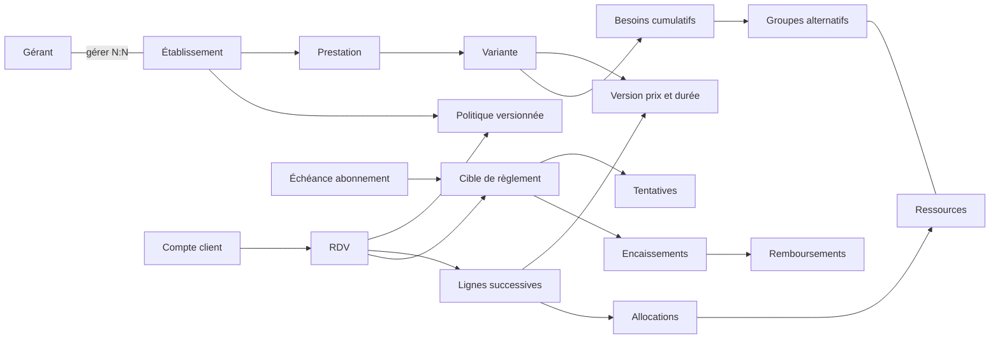

# Keke Beauty — Conception MERISE V1

Référence : cahier des charges local et dix décisions acceptées le 16 septembre 2026. Cette version prévaut sur les hypothèses contradictoires des V0. Les règles métier ci-dessous sont validées ; leur traduction technique reste un candidat à vérifier par exécution et recette. Aucun changement de base réelle effectué.

## 1. Règles de gestion consolidées

| ID | Règle applicable |
|---|---|
| V1-R01 | CI/XOF au lancement. Pays et monnaies administrables ; aucune conversion implicite des historiques. |
| V1-R02 | Un gérant peut gérer plusieurs salons ; un salon peut avoir plusieurs gérants avec permissions individuelles. Un seul responsable principal et au moins un gestionnaire avant activation. Limites administrables. |
| V1-R03 | Compte OTP obligatoire pour réserver ; droits vérifiés côté serveur. Vérification KYC préalable à l'activation partenaire. Les documents restent privés. |
| V1-R04 | Capacité configurable : globale, employés, ressources ou combinaison. Paramétrage explicite obligatoire avant activation. Une capacité absente n'est jamais illimitée. |
| V1-R05 | Chaque prestation propose des variantes à prix et durée déterminés. Plusieurs prestations successives du même salon sont autorisées par défaut. Les versions de prix/durée déjà acceptées sont immuables. |
| V1-R06 | Confirmation automatique selon disponibilités et droits. Allocation atomique ; aucune surcapacité, y compris pour deux requêtes concurrentes. Intervalles [début, fin[. |
| V1-R07 | Paiement intégral en espèces sur place par défaut. Avance désactivée par défaut ; le salon peut choisir facultative/obligatoire, fixe/pourcentage. Montant positif, plafonné au total, arrondi selon devise. |
| V1-R08 | Avance encaissée via Mobile Money au lancement ; carte en phase suivante. Un paiement tenté, initié ou affiché réussi par le navigateur ne vaut pas encaissement confirmé. |
| V1-R09 | Si avance obligatoire, maintien temporaire 10 minutes par défaut, configurable. Paiement vérifié avant expiration → confirmation ; sinon libération. Sans avance obligatoire, confirmation immédiate et possibilité de payer l'avance facultative ensuite. |
| V1-R10 | Paiement tardif : aucune réactivation automatique ; remboursement à traiter ou résolution explicite avec le client. Webhooks, requêtes et remboursements idempotents. |
| V1-R11 | Client autorisé à annuler/reporter jusqu'à 4 h avant le premier soin par défaut. Délai configurable, conditions présentées et figées à l'acceptation. Le report est atomique et conserve le RDV initial si la nouvelle place n'est pas disponible. |
| V1-R12 | Annulation salon ou client dans le délai : remboursement intégral de l'avance. Tardif/absence : politique configurable, remboursement intégral par défaut, conditions annoncées avant réservation. |
| V1-R13 | Un encaissement d'avance diminue le solde ; une confirmation n'est pas un paiement. Solde calculé, pas de colonne de solde tenue en parallèle. Les remboursements validés sont des opérations distinctes. |
| V1-R14 | Abonnement partenaire par Mobile Money au lancement. Engagement minimum un an ; facturation mensuelle ou annuelle, tarifs administrables et historiques conservés. |
| V1-R15 | Grâce 7 jours par défaut, configurable. Après grâce : nouvelles réservations bloquées, fiche visible, RDV existants conservés et gérables. Paiement vérifié rétablit les droits selon contrat. |
| V1-R16 | Africa/Abidjan par défaut, fuseau configurable par établissement. Instants stockés avec timezone ; horaires réguliers exprimés en heure locale. |
| V1-R17 | Une modification de configuration ne réécrit pas les conditions acceptées, ne supprime pas d'affectation et ne provoque pas de surbooking. Les configurations incompatibles sont refusées. |
| V1-R18 | Une notification part après commit. Une panne SMS ne supprime pas un RDV confirmé. Événement et message à envoyer enregistrés atomiquement ; reprises contrôlées. |

Les règles V0 sur l'annuaire, les médias, l'OTP, le KYC et la modération restent applicables lorsqu'elles ne contredisent pas cette version. Les visites physiques, audits d'hygiène, avis clients, RCCM obligatoire ou QR codes présents dans Stitch ne sont pas ajoutés au périmètre sans décision explicite.

## 2. Dictionnaire des données — compléments au DD V0

| ID | Donnée élémentaire | Domaine / contrainte | Propriétaire |
|---|---|---|---|
| DD-036 | Code devise | 3 lettres ; XOF au lancement | Devise |
| DD-037 | Décimales devise | Entier 0..4 ; XOF = 0 | Devise |
| DD-038 | Fuseau IANA | Africa/Abidjan par défaut ; validé dans le référentiel du moteur | Établissement |
| DD-039 | Responsable principal | Booléen ; exactement un avant activation | Affectation gérant/salon |
| DD-040 | Permission | Code stable ; une ligne par permission accordée | Affectation/permission |
| DD-041 | Version de politique | Numéro positif, unique par salon | Politique RDV |
| DD-042 | Délais annulation/report | Minutes entières ≥ 0 ; 240 par défaut | Politique RDV |
| DD-043 | Mode d'avance | désactivée / facultative / obligatoire | Politique RDV |
| DD-044 | Mode de calcul | fixe ou pourcentage ; absent si désactivée | Politique RDV |
| DD-045 | Valeur d'avance | Montant fixe dans la devise du salon ou taux ]0,100] | Politique RDV |
| DD-046 | Maintien | Minutes entières > 0 ; 10 par défaut | Politique RDV |
| DD-047 | Taux remboursé tardif/absence | Pourcentage 0..100 ; 100 par défaut | Politique RDV |
| DD-048 | Durée de variante | Minutes entières > 0 | Version de variante |
| DD-049 | Montant de variante | Nombre décimal ≥ 0 ; précision devise | Version de variante |
| DD-050 | Nature de ressource | employé, physique ou pool global | Ressource |
| DD-051 | Capacité | Entier > 0 ; employé = 1 | Ressource |
| DD-052 | Quantité requise | Entier > 0 | Besoin d'une variante |
| DD-053 | Groupe de ressources | Ensemble d'alternatives : choisir une ressource par besoin | Groupe / membre |
| DD-054 | Début / fin | Instants absolus, début < fin | Ligne de RDV |
| DD-055 | Expiration du maintien | Instant limite ; absent si confirmation immédiate | RDV |
| DD-056 | Clé idempotente | Unique par compte et opération, associée à une empreinte de requête | Demande |
| DD-057 | Avance due acceptée | Montant contractuel ≥ 0 et ≤ total ; pas le montant payé | RDV |
| DD-058 | Référence fournisseur | Unique par fournisseur ; ne jamais stocker ses clés secrètes | Tentative paiement |
| DD-059 | Montant encaissé | Positif, distinct d'une tentative ; auteur pour espèces | Encaissement |
| DD-060 | Montant remboursé | Positif ; cumul ≤ encaissement | Remboursement |
| DD-061 | Fin d'engagement | Au moins un an après début, année calendaire | Contrat |
| DD-062 | Fréquence facture | mensuelle ou annuelle | Tarif d'offre |
| DD-063 | Grâce | Jours entiers ≥ 0 ; 7 par défaut | Politique abonnement |
| DD-064 | Échéance due | Date limite et montant contractuel | Échéance |

Téléphones, coordonnées, médias, horaires, KYC et géographie : DD-001 à DD-035 conservés. Les anciennes questions sur pays, fuseau, multiplicité, prestations et avance sont résolues par V1-R01 à R16. OTP (durée/limites), conservation des pièces, tarifs commerciaux et prestataire Mobile Money restent à préciser avant leur mise en production ; ils n'empêchent pas la conception.

## 3. MCD — entités et associations

Chaque entité possède un identifiant conceptuel. Les associations n'introduisent pas de clés étrangères à ce niveau. Les cardinalités ci-dessous portent sur les occurrences persistées, avec minima d'activation explicités.

| Association | Côté A | Côté B | Propriété / contrainte |
|---|---|---|---|
| Gérer | Gérant 0,N | Établissement 0,N | principal ; salon activé : un principal |
| Autoriser | Affectation de gestion 0,N | Permission 0,N | permissions individuelles |
| Situer | Établissement 0,1 | Commune 0,N | commune obligatoire avant publication au lancement |
| Rattacher | Commune 1,1 | Ville 0,N | Ville 1,1 → Région ; Région 1,1 → Pays |
| Classer | Établissement 0,N | Catégorie 0,N | au moins une avant publication |
| Publier | Établissement 0,N | Média 1,1 | photo ou vidéo |
| Vérifier | Gérant 0,N | Dossier KYC 1,1 | historique de soumissions |
| Justifier | Dossier KYC 0,N | Justificatif 1,1 | au moins une pièce requise à soumission |
| Proposer | Établissement 0,N | Prestation 1,1 | appartient au salon |
| Décliner | Prestation 0,N | Variante 1,1 | au moins une pour réserver |
| Versionner | Variante 0,N | Version variante 1,1 | date d'effet, montant, durée ; immuable si acceptée |
| Régir | Établissement 0,N | Politique RDV 1,1 | versions datées |
| Accepter | RDV 1,1 | Politique RDV 0,N | conditions acceptées ; salon déduit de la politique |
| Demander | Compte 0,N | RDV 1,1 | client authentifié |
| Composer | RDV 1,N | Ligne RDV 1,1 | rang, début, fin ; soins successifs |
| Choisir | Ligne RDV 1,1 | Version variante 0,N | même salon que la politique |
| Équiper | Établissement 0,N | Ressource 1,1 | nature, capacité |
| Grouper | Groupe 1,N | Ressource 0,N | ressources alternatives du même salon |
| Exiger | Variante 0,N | Groupe 0,N | quantité ; au moins un besoin pour réserver |
| Allouer | Ligne RDV 1,N | Ressource 0,N | quantité ; respecte chaque besoin et disponibilité |
| Enregistrer | RDV 0,N | Événement RDV 1,1 | type, date, auteur |
| Notifier | Événement RDV 0,N | Notification 1,1 | destinataire, canal, état |
| Souscrire | Établissement 0,N | Contrat 1,1 | période d'engagement |
| Tarifer | Offre 0,N | Tarif offre 1,1 | fréquence, montant, devise, effet |
| Accepter tarif | Contrat 1,1 | Tarif offre 0,N | tarif immuable, pas de copie du prix courant |
| Facturer | Contrat 0,N | Échéance 1,1 | échéancier obligatoire à activation |
| Régler | Cible de règlement 0,N | Encaissement 1,1 | cible : RDV ou échéance, exclusive |
| Tenter | Cible de règlement 0,N | Tentative paiement 1,1 | Mobile Money ; aucun encaissement implicite |
| Aboutir | Tentative paiement 0,1 | Encaissement 0,1 | espèces sans tentative externe |
| Rembourser | Encaissement 0,N | Remboursement 1,1 | statut distinct de demande et validation |

Le diagramme est une vue de lecture ; les cardinalités normatives sont dans le tableau. Exemple : un soin exige un groupe « coiffeuses habilitées » ET un groupe « fauteuils ». Pour chaque groupe, on sélectionne une ressource disponible. En mode global, le groupe contient un pool unique de capacité N. Une même ressource apparaît une seule fois dans les allocations d'une ligne ; les quantités de besoins cumulés sont agrégées et contrôlées.

## 4. MLD — passage aux relations

Le socle V0 est conservé sauf TARIF_PRESTATION, remplacé par VARIANTE et VERSION_VARIANTE. Le script autonome `mpd/010_modele_v1.sql` reconstruit le schéma candidat à partir du socle, sans exécuter de migration destructive. Un index unique partiel borne à un principal par salon ; le minimum un est un contrôle d'activation.

Les relations détaillées, clés primaires, clés candidates, références et attributs sont listés dans [MLD_V1.md](MLD_V1.md), généré depuis le même catalogue que le SQL afin d'éviter une divergence de transcription. Les compléments de sens sont dans le DD ci-dessus.

Points de normalisation : le salon d'un RDV est déduit de sa politique, la prestation d'une ligne de sa version de variante, la devise d'un encaissement de sa cible. Ne pas recopier ces données dans les tables filles. Une cible de règlement porte soit un RDV, soit une échéance, et une devise acceptée ; le contrôle interrelations impose la devise des prix concernés. Une facture/échéance constitue un fait dû daté ; son montant est distinct du tarif catalogue.

## 5. MCT — événements, opérations et résultats

| Événement / synchronisation | Opération conceptuelle | Résultat |
|---|---|---|
| Téléphone fourni ET limites OTP respectées | Émettre puis vérifier le défi | Compte authentifié ou échec ; pas d'OTP en clair |
| Dossier complet soumis | Examiner l'identité du partenaire | Acceptation ou motif de refus, accès contrôlé |
| Configuration complète ET KYC conforme | Activer la réservation | Salon réservable selon droits d'abonnement |
| Demande authentifiée ET droits ouverts | Contrôler prix, règles, horaires et toutes capacités | Refus motivé ou allocation atomique |
| Allocation valide ET avance non obligatoire | Confirmer | RDV confirmé, événement et notification à envoyer |
| Allocation valide ET avance obligatoire | Maintenir temporairement | RDV en attente de paiement, expiration et demande de règlement |
| Paiement fiable ET maintien non expiré | Encaisser puis confirmer | Un encaissement, un RDV confirmé, notification |
| Horloge ≥ expiration ET RDV toujours en attente | Expirer | Capacité libérée, paiement tardif traité séparément |
| Paiement tardif ou incohérent | Rapprocher | Encaissement identifié, remboursement/résolution à traiter ; pas de réservation fantôme |
| Demande annulation autorisée | Annuler et calculer restitution | Capacité libérée, remboursement dû selon politique acceptée |
| Demande report autorisée ET nouvelle capacité | Reprogrammer atomiquement | Nouveau planning ; sinon ancien planning intact |
| Soin terminé et espèces reçues | Constater encaissement | Solde recalculé ; aucun double enregistrement |
| Échéance impayée et fin de grâce | Recalculer droits | Nouvelles réservations bloquées, RDV existants conservés |
| Paiement abonnement vérifié | Affecter règlement | Échéance réglée selon montant ; droits recalculés |
| Message en attente | Envoyer puis enregistrer résultat | Envoi ou reprise ; réservation inchangée |

États RDV : ATTENTE_PAIEMENT → CONFIRME ou EXPIRE ; CONFIRME → ANNULE, TERMINE ou ABSENT. Le report est un événement et un changement de planning, pas un statut qui efface la confirmation. La décision de report conserve conditions/prix acceptés ; changer les prestations relève d'une nouvelle proposition acceptée, pas d'une modification silencieuse.

## 6. MOT — qui, où et quand

| Traitement | Responsable / lieu | Moment et contrôle |
|---|---|---|
| Compte et réservation | Client, interface web responsive | Immédiat ; OTP et contrôles serveur |
| Prestations, employés et ressources | Gestionnaire habilité, espace partenaire | Avant publication ; prévisualisation des modifications |
| Politique client | Gestionnaire habilité, espace partenaire | Nouvelle version ; historique conservé |
| KYC | Administrateur habilité, console privée | Asynchrone ; auteur/date/motif tracés |
| Allocation et confirmation | Service de réservation, serveur | Transaction courte ; ordre stable de verrouillage |
| Mobile Money | Serveur paiement et fournisseur choisi | Webhook vérifié et rapprochement ; aucun secret côté navigateur |
| Expiration des maintiens | Traitement planifié serveur | Échéance et contrôle transactionnel à chaque réservation |
| Espèces | Gestionnaire habilité, salon | Après réception effective ; auteur et clé d'opération |
| Remboursement | Service paiement / administrateur en exception | Contrôle montant, destination d'origine et retour fournisseur |
| Abonnements et grâce | Administration + traitement serveur | Échéances calculées ; contrôle de droits aussi à chaque réservation |
| Notifications | Service d'envoi | Après commit ; reprise avec clé de déduplication |

Le fuseau du salon s'applique à l'affichage et aux horaires réguliers. Une modification de fuseau ne déplace pas les instants déjà réservés. En cas d'extension à un fuseau avec changement d'heure, refuser les heures inexistantes et désambiguïser les heures répétées.

## 7. MPD — contraintes et protocole de concurrence

DDL PostgreSQL candidat : `mpd/010_modele_v1.sql`, **base vide uniquement**, pas une migration depuis le V0. Générateur : `build_merise_v1.py`. Pas de déploiement automatique.

Le DDL impose PK, FK, plusieurs clés alternatives, domaines, montants positifs et cohérence locale. Les contrôles interrelations suivants doivent être implémentés dans le service transactionnel ou dans des fonctions SQL avant activation ; le DDL seul ne garantit PAS encore l'absence de surbooking :

1. Verrouiller les salons concernés puis ressources dans l'ordre croissant des identifiants, pour réservation, report, fermeture et changement de capacité. Recontrôler droits et configuration après acquisition. Les lectures de disponibilité seules n'allouent rien.
2. Écarter les maintiens expirés selon l'horloge serveur. Compter les allocations confirmées ou en attente non expirée, sur chaque sous-intervalle découpé par les débuts/fins. Vérifier capacité à tout instant ; ne pas additionner aveuglément tous les RDV croisant une demande.
3. Vérifier besoins de chaque variante, appartenance salon, habilitations, pauses, horaires, séquence des lignes et durée. Une ligne n'est pas validée avec zéro allocation.
4. Verrouiller le RDV lors d'un webhook et d'une expiration. Si expiration gagnante ou paiement reçu après échéance, ne pas confirmer ; enregistrer le paiement fiable et son traitement de restitution. Les index uniques empêchent le même encaissement externe deux fois.
5. Création du RDV, lignes, allocations, demande idempotente, événement et notifications dans une transaction. Déduplication par compte/clé ; même clé et contenu différent rejetés. Notification après commit.
6. Contrôler total, devise homogène, précision monétaire et avance ≤ total. Remboursements cumulés validés/en cours ≤ encaissement sous verrou. Encaissement électronique lié à une tentative de même cible, montant et devise. Ne jamais accepter un succès uniquement déclaratif du navigateur.
7. Empêcher toute mutation d'une version acceptée. Les changements créent une version ; report ne remplace pas la politique acceptée. Conserver les événements d'ancien/nouveau planning.
8. Vérifier un principal au minimum, limites administratives, habilitations et KYC à l'activation. Une fermeture ou réduction de capacité en conflit avec des RDV doit être refusée ou faire l'objet d'une résolution explicite.

Les intégrations de paiement et les règles de sécurité OTP/KYC seront détaillées dans leurs spécifications avant développement. Le SQL ne doit pas être présenté comme une application complète ou comme une migration prête en production.

## 8. Audit 1FN / 2FN / 3FN

| Famille | Clés et dépendances | Vérification |
|---|---|---|
| Géographie, compte, gérant, catégories, médias, KYC | Identifiant → propriétés propres ; code rôle → libellé | Valeurs atomiques ; aucun nom de parent dupliqué. Audit V0 maintenu ; clés naturelles téléphone/gérant à confirmer avant unicité. |
| Gestion et permissions | Couple gérant/salon → principal ; triplet gérant/salon/permission sans attribut non-clé | Dépendance sur clé entière ; aucune copie du nom ou libellé de permission. |
| Devise et pays/devise | Code devise → libellé,décimales ; association sans attribut non-clé | Métadonnées monnaie séparées ; pas de liste dans une colonne. |
| Variantes et versions | Identifiant version et (variante,date_effet) → durée,montant,devise | Tous les attributs dépendent de chaque clé candidate entière ; aucune copie de la prestation ou du salon. |
| Politiques | ID et (salon,version) → conditions | Valeurs scalaires ; bornes et modes sont des contraintes de domaine, pas des libellés recopiés. Références historiques immuables. |
| Besoins, groupes, membres | (variante,groupe) → quantité ; (groupe,ressource) sans attribut non-clé | Alternatives en lignes ; ressources propres indépendantes ; pas de dépendance sur une moitié de clé. |
| RDV, lignes et allocations | RDV → client,politique,état,expiration,avance acceptée ; (RDV,rang) → version,début,fin ; (RDV,rang,ressource) → quantité | Salon non recopié ; total et solde calculés ; fin est l'instant planifié contractuel (peut inclure une adaptation explicitement acceptée), pas une deuxième copie de durée catalogue. |
| Offre, tarif, contrat, échéance | Tarif → offre/fréquence/prix ; contrat → tarif/politique/période ; échéance → contrat/période/montant dû | Offre/prix pas recopiés dans contrat ; échéance est un fait de facturation daté distinct. |
| Cible, tentative, encaissement, remboursement | ID cible et référence métier exclusive → devise ; référence fournisseur candidate → tentative/encaissement ; remboursement → encaissement/montant/état | Devise non recopiée dans paiements ; sous-type électronique sans cible dupliquée (voir MLD). Espèces dans sous-type séparé ; plafonds interlignes hors preuve 3FN. |
| Événements, notifications, idempotence | ID événement → fait ; (événement,destinataire,canal) → état ; (compte,clé) → empreinte et résultat | Une occurrence par fait/envoi ; aucune donnée du destinataire recopiée. |
| Horaires, indisponibilités et historique de report | ID plage/indisponibilité → propriétaire,bornes ; (événement,numéro) → anciennes et nouvelles bornes | Plages en lignes ; historique rattaché au fait, sans RDV dupliqué puisque l'événement le détermine. |
| Configuration plateforme et permissions | ID et date_effet → limites ; code permission → libellé | Version de configuration atomique ; limites administratives séparées des capacités de ressources. |

Conclusion : décomposition conforme aux dépendances métier recensées ; revue statique de conception. Ni les PK techniques seules ni une exécution SQL réussie ne constituent une certification universelle de 3FN. Les contraintes de concurrence et interrelations restent à réaliser et tester. Les tables générées sont inventoriées dans MLD_V1 ; toute nouvelle dépendance doit déclencher une révision.

## 9. Recette nécessaire avant mise en service

- Deux réservations concurrentes sur la dernière place : une seule acceptée ; capacité N jamais dépassée.
- Créneaux adjacents acceptés ; chevauchement refusé ; groupes alternatifs et besoins cumulatifs respectés.
- Plusieurs prestations successives ; prix et conditions historiques inchangés après édition du catalogue.
- Avance désactivée, facultative et obligatoire ; montant fixe/pourcentage ; total nul ; arrondi XOF ; solde correct.
- Expiration simultanée à un paiement, webhook doublé, paiement tardif, remboursement doublé et partiel.
- Report concurrent échoué : ancien rendez-vous intact. Annulation salon : remboursement intégral.
- Grâce 7 jours : pas de nouvelle réservation après limite ; fiche et gestion des RDV conservées.
- Gestionnaire sans permission refusé ; activation sans principal ou sans configuration refusée.
- Notification en panne : réservation conservée, reprise sans double réservation.

## 10. Reste de la conception et de la réalisation

Décisions du point 1 closes. À exécuter : validation SQL sur PostgreSQL, contraintes interrelations et service de concurrence, fournisseur Mobile Money et gestion opérationnelle des remboursements, tarifs des offres, politiques techniques OTP et conservation KYC, puis migrations applicatives et tests. Spec Kit n'a pas été installé ; la présente consolidation suit MERISE et le cahier des charges.
